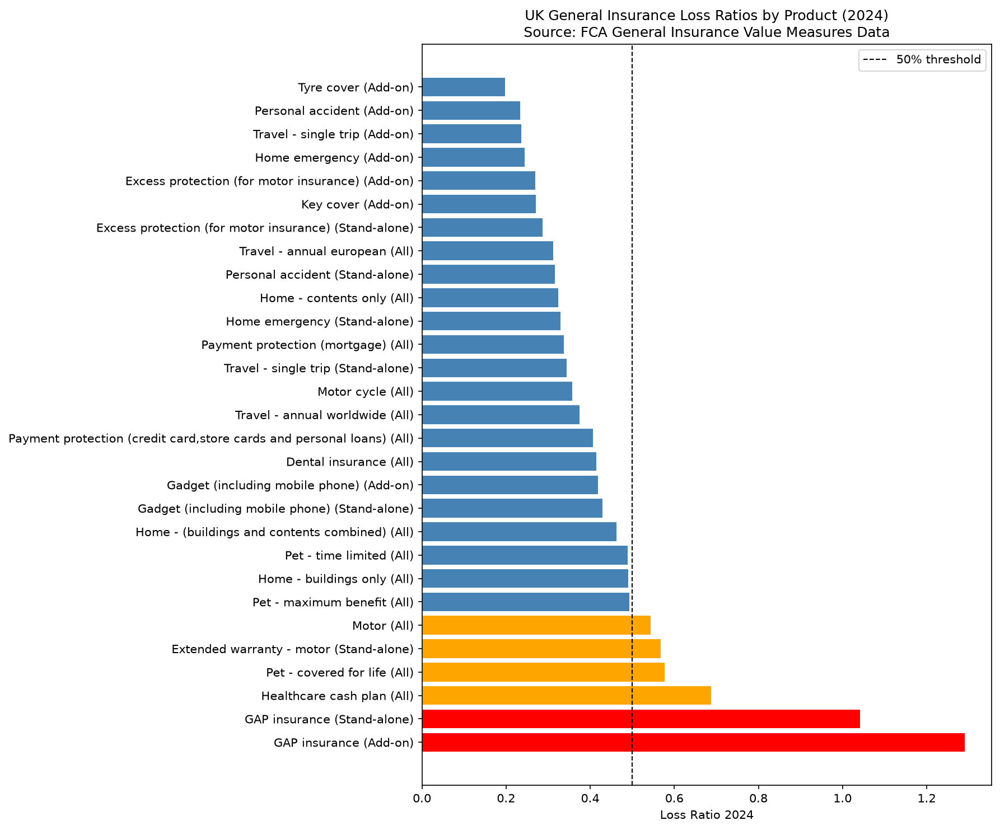
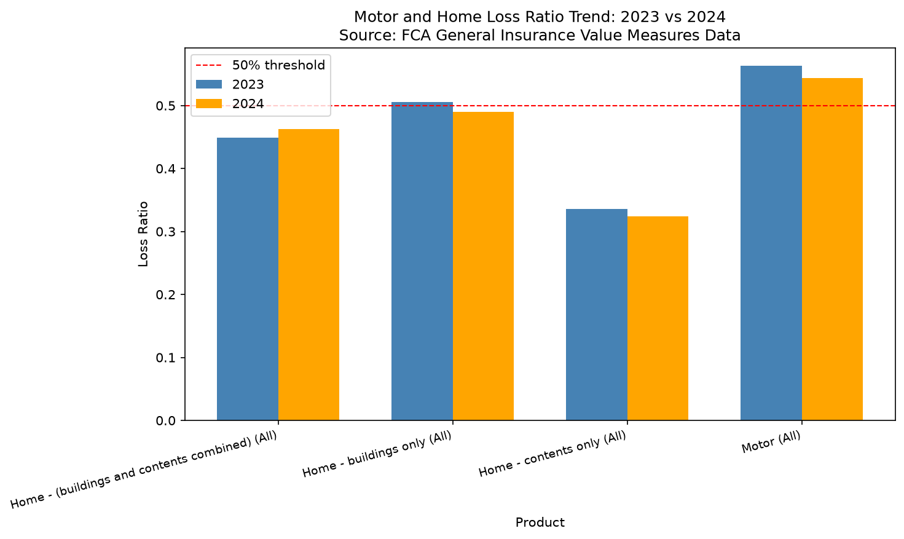
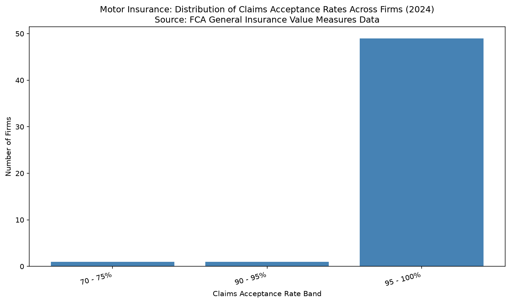
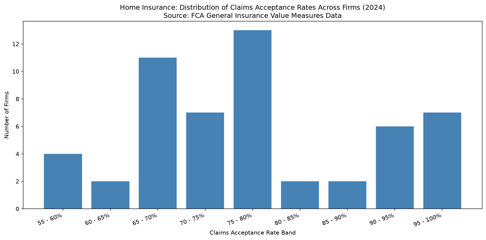

# UK General Insurance Pricing Analysis

Analysis of the FCA General Insurance Value Measures dataset (2024) using Python and SQL, focused on loss ratio benchmarking, trend analysis, and competitive pricing insights across Admiral's core motor and home product lines.

## Tools Used

- Python (pandas, matplotlib, sqlite3)
- SQL (SQLite)
- Data Source: FCA General Insurance Value Measures Data 2024

## Key Findings

**GAP insurance recorded a loss ratio of 129% in 2024**, making it a loss making product across the market.

**Motor insurance improved from 56.3% to 54.4%**, suggesting premium increases are outpacing claims growth. **Home insurance moved in the opposite direction**, rising from 44.9% to 46.3%, signalling an emerging pricing risk.

**Home insurance claims acceptance rates show a 45 percentage point spread across firms**, flagging a key risk for competitive benchmarking, compared to far tighter concentration in motor.

**Admiral (EUI Limited) sits in the top 95 to 100% claims acceptance band for motor**, in line with 49 out of 51 market participants.

## Project Structure

- `FCA_Insurance_Pricing_Analysis.ipynb` — full analysis notebook with code, charts and recommendations
